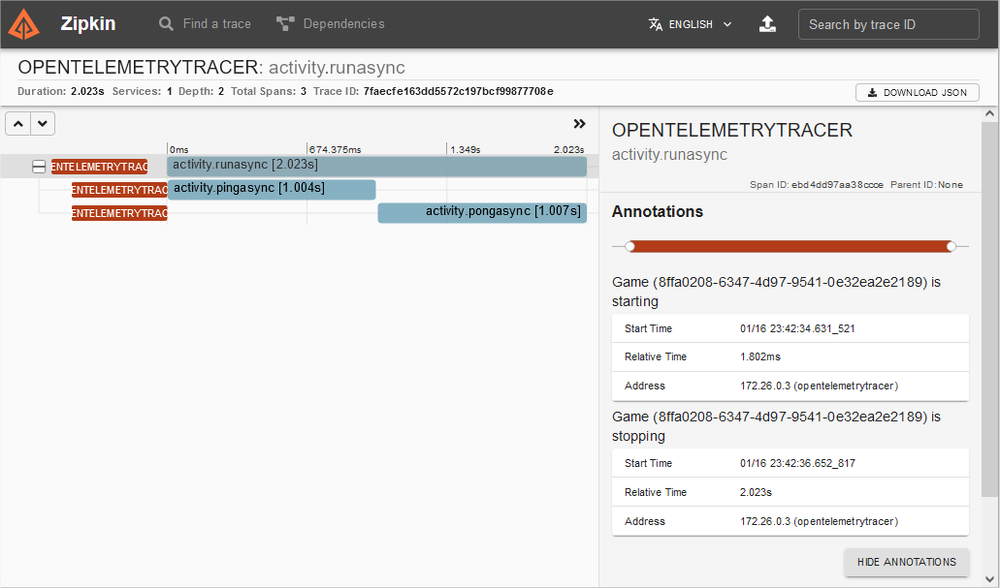

[](https://github.com/aimenux/OpenTelemetryConsoleDemo/actions/workflows/ci.yml)

# OpenTelemetryConsoleDemo
```
Using OpenTelemetry with console applications
```

In this demo, i m using [OpenTelemetry](https://devblogs.microsoft.com/dotnet/opentelemetry-net-reaches-v1-0/) in order to build instrumentation within a console application.
>
>
:rocket: To run code, follow these steps :
> 
> - Start docker containers : type `docker compose up` in your terminal
>
> - Open [zipkin url](http://localhost:9411/zipkin) in your browser
>
> - Stop docker containers : type `docker compose down` in your terminal



**`Tools`** : vs22, net 6.0, docker, opentelemetry, zipkin
